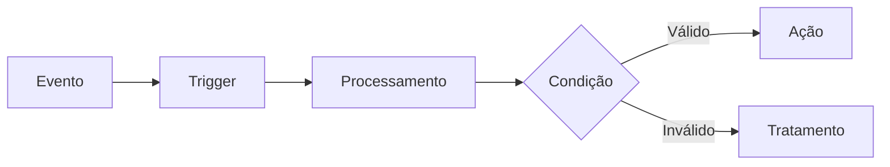
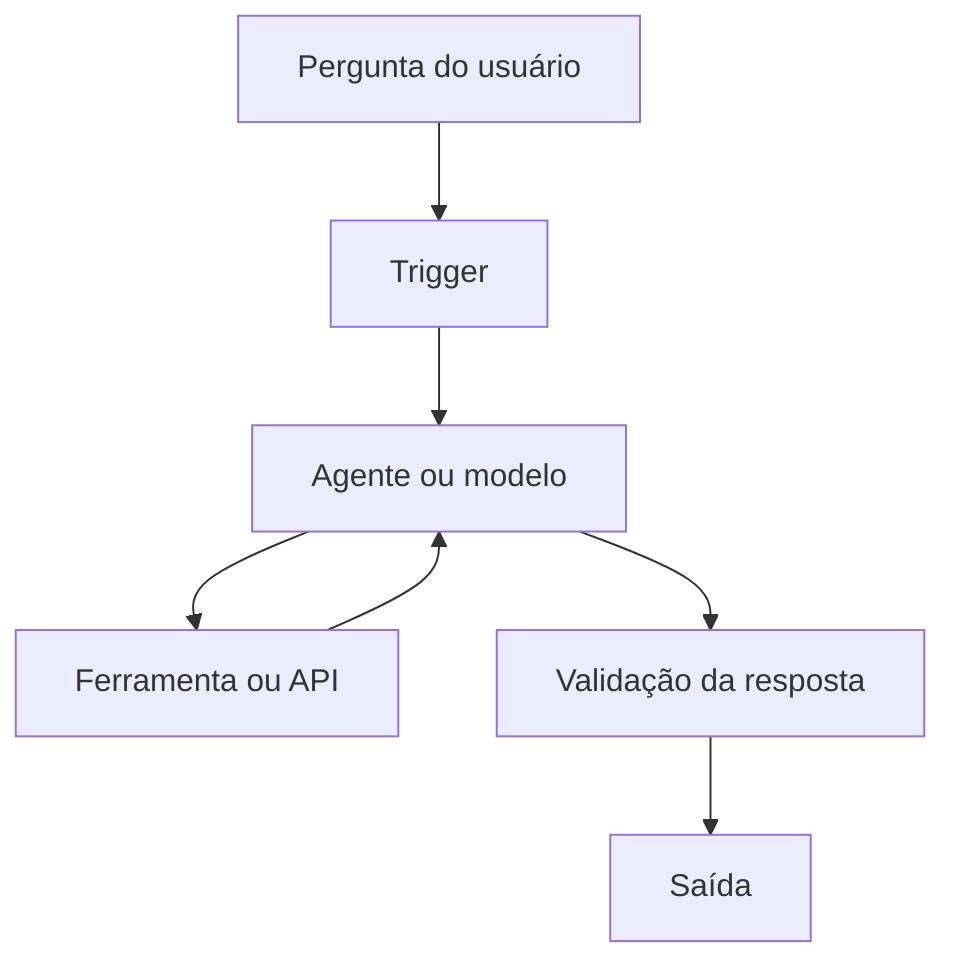

# Caderno Temático no NotebookLM: Especialista em n8n


## Sobre o projeto

Este repositório documenta a criação de um caderno temático no **Google NotebookLM** para apoiar meus estudos sobre **n8n**, como parte de um desafio do Bootcamp da [DIO](https://www.dio.me/).

O n8n é uma plataforma de automação de workflows que permite integrar serviços, APIs, bancos de dados e ferramentas de inteligência artificial por meio de fluxos visuais. O NotebookLM foi escolhido como ambiente de aprendizagem ativa porque responde com base nas fontes selecionadas e permite conferir as referências utilizadas.

> **Tema escolhido:** automação de processos e integração de sistemas com n8n.

## Objetivos de estudo

- Entender os componentes fundamentais do n8n: workflows, nodes, triggers, actions e executions.
- Aprender como os dados trafegam entre os nodes e como manipulá-los com expressões.
- Construir automações reutilizáveis e fáceis de manter.
- Aplicar tratamento de erros, testes e boas práticas de segurança.
- Explorar integrações com APIs, webhooks e agentes de IA.
- Transformar a documentação oficial em um material de consulta rápida.
- Usar engenharia de prompts para estudar de forma ativa, verificável e orientada à prática.

## Ferramentas utilizadas

- [n8n](https://n8n.io/) — criação e execução das automações.
- [Google NotebookLM](https://notebooklm.google.com/) — organização das fontes e apoio ao estudo.
- [Documentação oficial do n8n](https://docs.n8n.io/) — base principal de conhecimento.
- GitHub — versionamento e publicação do projeto.

## Curadoria de fontes

Foram selecionadas fontes abertas da documentação oficial, priorizando materiais introdutórios e páginas que organizam a sequência de aprendizagem.

| # | Fonte | Finalidade no caderno |
|---|---|---|
| 1 | [Documentação oficial do n8n](https://docs.n8n.io/welcome.md) | Visão geral da plataforma e acesso aos principais assuntos. |
| 2 | [Build your first workflow](https://docs.n8n.io/build-your-first-workflow.md) | Construção prática do primeiro workflow. |
| 3 | [Key concept glossary](https://docs.n8n.io/key-concept-glossary.md) | Definições dos conceitos essenciais do n8n. |
| 4 | [Learning paths](https://docs.n8n.io/learning-paths.md) | Organização da trilha de aprendizagem para diferentes níveis. |
| 5 | [Choose how to use n8n](https://docs.n8n.io/choose-how-to-use-n8n.md) | Comparação das formas de utilização e hospedagem do n8n. |

### Critérios de seleção

1. Fontes oficiais e abertas.
2. Conteúdo diretamente relacionado aos objetivos do estudo.
3. Cobertura equilibrada entre conceitos, prática e infraestrutura.
4. Material em texto, adequado para indexação pelo NotebookLM.
5. Possibilidade de validar cada resposta por meio das citações apresentadas pela ferramenta.

## Configuração do caderno no NotebookLM

1. Acessar o [NotebookLM](https://notebooklm.google.com/).
2. Criar um notebook com o nome **Especialista em n8n**.
3. Adicionar as cinco fontes listadas neste README.
4. Conferir se todas as fontes foram processadas corretamente.
5. Usar os prompts deste projeto para explorar o conteúdo.
6. Validar as respostas consultando as citações indicadas pelo NotebookLM.
7. Registrar novos aprendizados e dificuldades neste repositório.

## Engenharia de prompts

### Estratégia adotada

Os prompts foram elaborados com cinco elementos:

1. **Papel:** definir o NotebookLM como tutor especialista em n8n.
2. **Contexto:** informar meu nível de conhecimento e o objetivo da consulta.
3. **Tarefa:** descrever exatamente o resultado esperado.
4. **Formato:** determinar como a resposta deve ser organizada.
5. **Evidência:** exigir que a resposta seja fundamentada apenas nas fontes do caderno.

### Prompt-base do especialista

```text
Atue como meu tutor especialista em n8n. Responda somente com base nas fontes
deste notebook. Explique o assunto em português do Brasil, de forma progressiva,
partindo dos fundamentos até a aplicação prática. Sempre que possível, inclua
um exemplo de workflow, indique os nodes envolvidos, descreva o fluxo dos dados
e cite as fontes usadas. Caso as fontes não sejam suficientes, informe claramente
a limitação em vez de completar a resposta com suposições.
```

### Perguntas estratégicas

| Objetivo | Prompt |
|---|---|
| Diagnóstico inicial | `Quais conhecimentos preciso dominar para sair do nível iniciante e construir workflows confiáveis no n8n? Organize em uma trilha de quatro etapas.` |
| Compreensão | `Explique a diferença entre workflow, node, trigger, action e execution. Use uma analogia e depois apresente a definição técnica.` |
| Aplicação | `Proponha um workflow simples que receba dados por webhook, valide campos obrigatórios e devolva uma resposta. Liste os nodes e a função de cada um.` |
| Dados | `Explique como os dados passam entre os nodes no n8n e mostre exemplos de acesso a valores com expressões.` |
| Comparação | `Compare n8n Cloud e self-hosted considerando instalação, manutenção, segurança, escalabilidade e perfil de usuário.` |
| Troubleshooting | `Crie um checklist para diagnosticar um workflow que funciona manualmente, mas falha quando é executado automaticamente.` |
| Revisão | `Elabore dez perguntas de revisão sobre n8n, sem mostrar as respostas. Depois que eu responder, corrija cada item citando as fontes.` |
| Projeto prático | `Sugira três projetos progressivos de automação com n8n. Para cada um, informe objetivo, nodes, dados de entrada, saída esperada e principais riscos.` |

## Testes de prompts e “cicatrizes” do aprendizado

Esta seção registra não apenas os acertos, mas também as limitações encontradas. Os testes abaixo formam um **roteiro reproduzível**: os campos de resultado devem ser atualizados após a execução no NotebookLM, preservando as citações fornecidas pela ferramenta.

### Teste 1 — Prompt genérico

**Prompt:**

```text
Explique n8n.
```

**Resultado esperado:** resposta correta, porém ampla e pouco orientada à prática.

**Problema identificado:** o prompt não informa o nível do estudante, o recorte do assunto nem o formato desejado.

**Melhoria aplicada:**

```text
Explique o que é n8n para uma pessoa iniciante em automação. Diferencie workflow,
trigger e action, apresente um exemplo simples e finalize com três perguntas de
revisão. Use somente as fontes deste notebook e inclua as citações.
```

**Resultado obtido no NotebookLM:** _preencher após executar o teste_.

**Referências apresentadas:** _registrar as citações indicadas pelo NotebookLM_.

### Teste 2 — Resposta sem restrição de fonte

**Prompt inicial:**

```text
Mostre todas as melhores práticas de segurança para n8n.
```

**Dificuldade:** palavras como “todas” e “melhores” tornam o pedido absoluto. As fontes selecionadas podem não cobrir segurança em profundidade.

**Prompt revisado:**

```text
Com base exclusivamente nas fontes deste notebook, identifique as práticas de
segurança mencionadas para usar n8n. Separe as recomendações para n8n Cloud e
self-hosted. Quando uma informação não estiver disponível, marque-a como
“não coberta pelas fontes”.
```

**Aprendizado:** restringir o universo da resposta reduz generalizações e torna as lacunas documentais visíveis.

**Resultado obtido no NotebookLM:** _preencher após executar o teste_.

### Teste 3 — Solicitação prática sem contexto suficiente

**Prompt inicial:**

```text
Crie uma automação de e-mail.
```

**Dificuldade:** faltam evento de início, provedor, entrada, regras e saída esperada.

**Prompt revisado:**

```text
Desenhe um workflow didático no n8n que seja iniciado por webhook, receba nome,
e-mail e mensagem, valide os campos, envie um e-mail e retorne o status ao
solicitante. Apresente: sequência dos nodes, configuração conceitual, dados que
entram e saem de cada etapa, possíveis falhas e estratégia de teste. Não invente
parâmetros que não estejam descritos nas fontes.
```

**Aprendizado:** prompts para automações ficam melhores quando especificam gatilho, entrada, regras de negócio, saída e tratamento de falhas.

**Resultado obtido no NotebookLM:** _preencher após executar o teste_.

### Principais cicatrizes

- Um prompt curto demais tende a produzir uma explicação superficial.
- Pedidos absolutos podem induzir respostas que excedem o conteúdo das fontes.
- Uma resposta bem escrita não é necessariamente uma resposta comprovada; é preciso abrir e conferir as citações.
- O NotebookLM ajuda a estudar as fontes, mas não substitui a execução do workflow no n8n.
- Documentações de software mudam. Links, nomes de nodes e comportamentos devem ser conferidos antes de aplicar uma solução em produção.
- Solicitações práticas precisam explicitar entrada, processamento, saída, restrições e critérios de sucesso.

## Miniguia de estudo sobre n8n

### 1. O que é n8n?

O n8n é uma ferramenta de automação baseada em workflows. Cada workflow representa um processo composto por nodes conectados. Esses nodes podem iniciar o fluxo, consultar serviços externos, transformar dados, executar regras ou produzir uma saída.

Uma automação típica segue esta lógica:



### 2. Componentes fundamentais

- **Workflow:** conjunto de nodes conectados que representa uma automação.
- **Node:** unidade que executa uma função específica dentro do workflow.
- **Trigger:** node que inicia o workflow a partir de um evento, horário ou chamada.
- **Action:** operação realizada em um serviço ou nos dados.
- **Connection:** ligação que determina o caminho dos dados entre os nodes.
- **Execution:** registro de uma tentativa de execução do workflow.
- **Credential:** configuração protegida usada para autenticar o acesso a serviços.
- **Expression:** instrução dinâmica usada para acessar ou transformar valores.

### 3. Fluxo de dados

Em geral, os nodes recebem itens, processam seus dados e entregam novos itens ao node seguinte. Os valores costumam ser estruturados em JSON. Compreender essa estrutura é essencial para mapear campos e diagnosticar erros.

Exemplos comuns de expressões:

```javascript
{{$json.nome}}
{{$json.email}}
{{$now}}
{{$node["Nome do node"].json["campo"]}}
```

> A expressão exata depende da estrutura recebida e da versão do n8n. Antes de usá-la, confira o painel de dados da execução.

### 4. Estrutura recomendada de um workflow

1. Receber ou buscar os dados.
2. Validar campos obrigatórios.
3. Normalizar e transformar os valores.
4. Aplicar condições e regras de negócio.
5. Executar a ação principal.
6. Registrar o resultado.
7. Tratar e comunicar possíveis falhas.

### 5. Nodes importantes para começar

| Node ou categoria | Uso típico |
|---|---|
| Manual Trigger | Iniciar testes manualmente. |
| Schedule Trigger | Executar o workflow em horários definidos. |
| Webhook | Receber chamadas HTTP de sistemas externos. |
| HTTP Request | Consumir APIs REST. |
| Edit Fields (Set) | Criar, selecionar ou reorganizar campos. |
| If / Switch | Criar decisões e ramificações. |
| Code | Aplicar lógica personalizada quando os recursos visuais não forem suficientes. |
| Merge | Combinar dados provenientes de caminhos diferentes. |
| Respond to Webhook | Retornar uma resposta ao sistema que chamou o webhook. |

### 6. Testes e troubleshooting

Ao investigar uma falha:

1. Confirme se o workflow está ativo quando a execução automática exigir isso.
2. Verifique a entrada real recebida pelo node que falhou.
3. Compare os nomes e os tipos dos campos com o formato esperado.
4. Teste as credenciais e as permissões do serviço externo.
5. Confira URL, método HTTP, cabeçalhos, parâmetros e corpo da requisição.
6. Analise status HTTP e mensagem de erro.
7. Teste o fluxo por partes, usando dados controlados.
8. Considere limites de API, paginação, timeout e indisponibilidade temporária.
9. Evite expor tokens, senhas ou dados pessoais nos logs.
10. Registre a causa, a correção e como evitar a reincidência.

### 7. Boas práticas

- Usar nomes claros para workflows e nodes.
- Adicionar notas para explicar regras menos óbvias.
- Manter credenciais fora de campos de texto e do código.
- Validar os dados o mais cedo possível.
- Tratar falhas previsíveis e criar caminhos de recuperação.
- Evitar workflows excessivamente grandes; separar responsabilidades quando necessário.
- Testar com casos válidos, inválidos e limites.
- Observar histórico de execuções, consumo de recursos e integrações externas.
- Documentar dependências, entradas, saídas e responsáveis.
- Exportar ou versionar workflows importantes de forma segura, sem segredos.

### 8. n8n e inteligência artificial

O n8n pode orquestrar modelos de linguagem, fontes de dados, memória e ferramentas externas. Entretanto, uma automação com IA continua precisando de entradas bem definidas, validação, controle de acesso, limites de custo e tratamento de respostas inesperadas.

Uma arquitetura didática pode conter:



## Glossário

| Termo | Definição resumida |
|---|---|
| API | Interface que permite a comunicação entre sistemas. |
| Authentication | Processo de comprovação da identidade ao acessar um serviço. |
| Credential | Configuração de autenticação armazenada para uso pelos nodes. |
| Execution | Ocorrência registrada da execução de um workflow. |
| Expression | Sintaxe usada para obter ou calcular valores dinamicamente. |
| Item | Unidade de dados que percorre os nodes do workflow. |
| JSON | Formato estruturado amplamente utilizado na troca de dados. |
| Node | Componente que executa uma etapa do processo. |
| Polling | Consulta periódica a um serviço em busca de novos dados. |
| Trigger | Node ou evento responsável por iniciar um workflow. |
| Webhook | Endpoint HTTP que recebe eventos ou dados de outro sistema. |
| Workflow | Sequência conectada de etapas que implementa uma automação. |

## Prompts reutilizáveis

### Explicação progressiva

```text
Explique [CONCEITO DO N8N] em três níveis: iniciante, intermediário e técnico.
Inclua um exemplo prático, um erro comum e uma pergunta para verificar meu
entendimento. Baseie-se apenas nas fontes e cite as referências.
```

### Planejamento de workflow

```text
Planeje um workflow no n8n para [OBJETIVO]. A entrada será [ENTRADA], as regras
são [REGRAS] e a saída esperada é [SAÍDA]. Informe os nodes em ordem, os dados
trocados, as credenciais necessárias, os riscos e os testes de aceitação.
```

### Diagnóstico de erro

```text
Ajude-me a diagnosticar este erro no n8n: [ERRO]. O workflow deveria [OBJETIVO],
mas ocorreu [COMPORTAMENTO]. Organize hipóteses da mais provável para a menos
provável e indique como confirmar ou descartar cada uma. Não invente configurações
ausentes; diga quais evidências ainda preciso fornecer.
```

### Comparação de soluções

```text
Compare [SOLUÇÃO A] e [SOLUÇÃO B] no contexto do n8n. Use os critérios
[CRITÉRIOS], apresente uma tabela e recomende uma opção para [CENÁRIO].
Fundamente a análise nas fontes do notebook e explicite qualquer lacuna.
```

### Revisão ativa

```text
Crie um quiz com 10 questões sobre [TEMA DO N8N], misturando conceitos e
situações práticas. Não revele o gabarito inicialmente. Após minhas respostas,
corrija cada questão, explique meus erros e indique as fontes para revisão.
```

### Análise de workflow

```text
Analise a descrição deste workflow: [DESCRIÇÃO]. Identifique objetivo, gatilho,
entradas, transformações, saídas, dependências, riscos, pontos de falha e
oportunidades de melhoria. Separe fatos confirmados de hipóteses.
```

## Plano de aprendizagem prática

- [ ] Criar o notebook **Especialista em n8n** no NotebookLM.
- [ ] Carregar e validar as cinco fontes.
- [ ] Executar os três testes de prompt e registrar resultados e citações.
- [ ] Construir um workflow com Manual Trigger e Edit Fields.
- [ ] Consumir uma API pública com HTTP Request.
- [ ] Criar uma decisão com If ou Switch.
- [ ] Criar e testar um Webhook.
- [ ] Implementar tratamento de erro.
- [ ] Construir uma automação com IA.
- [ ] Revisar o glossário e executar o quiz final.

## Conclusão

Este projeto mostra que a IA pode ser utilizada como ferramenta de aprendizagem ativa, e não apenas como geradora de respostas. A combinação entre curadoria de fontes, prompts bem estruturados, validação de citações e experimentação prática permite estudar n8n de maneira mais organizada e crítica.

O principal aprendizado é que a qualidade da resposta depende de três fatores: **qualidade das fontes, clareza do prompt e validação do resultado**. O NotebookLM funciona como tutor e organizador do conhecimento; o domínio do n8n, porém, é consolidado ao construir, testar, corrigir e documentar workflows reais.

## Próximos passos

- Ampliar o caderno com fontes específicas sobre expressões, webhooks, APIs e tratamento de erros.
- Registrar capturas de tela dos workflows desenvolvidos.
- Adicionar exemplos exportados em JSON sem credenciais ou dados sensíveis.
- Criar um projeto final integrando webhook, API, persistência e agente de IA.
- Atualizar o material sempre que mudanças relevantes forem publicadas na documentação.

## Autor

Desenvolvido por **Tiago Musardo** como parte do desafio de projeto do Bootcamp n8n da DIO.

---

⭐ Se este conteúdo foi útil, considere marcar o repositório com uma estrela.
